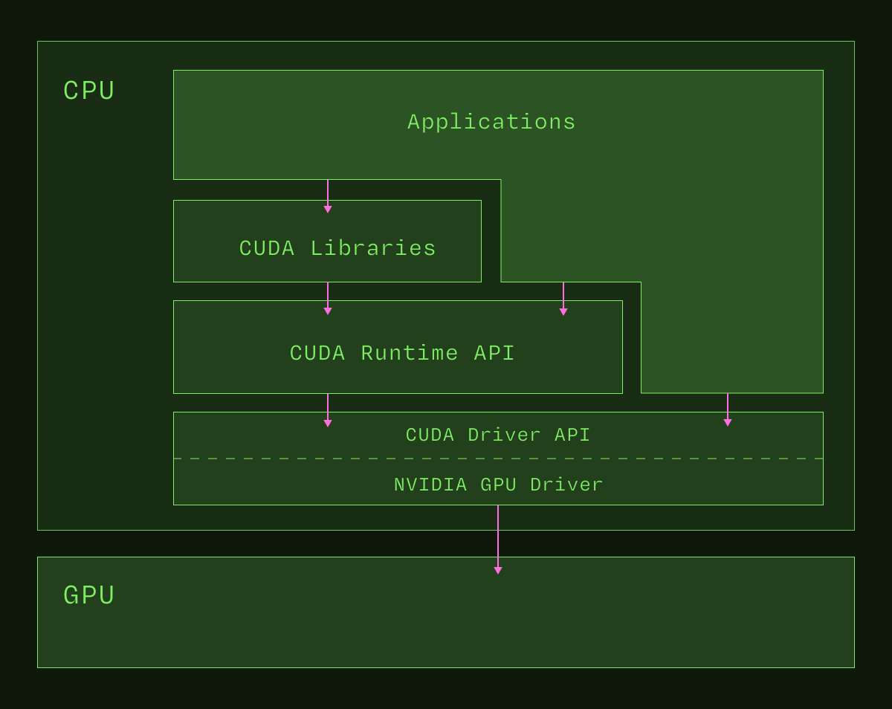

The NVIDIA GPU drivers mediate the interaction between host programs or the host
operating system and the GPU device. The primary interfaces to the GPU drivers
for applications are, in order, the
[CUDA Runtime API](/gpu-glossary/host-software/cuda-runtime-api.md) and the
[CUDA Driver API](/gpu-glossary/host-software/cuda-driver-api.md).

NVIDIA has released the
[source](https://github.com/NVIDIA/open-gpu-kernel-modules) for their Linux Open
GPU [Kernel Module](/gpu-glossary/host-software/nvidia-ko.md).
